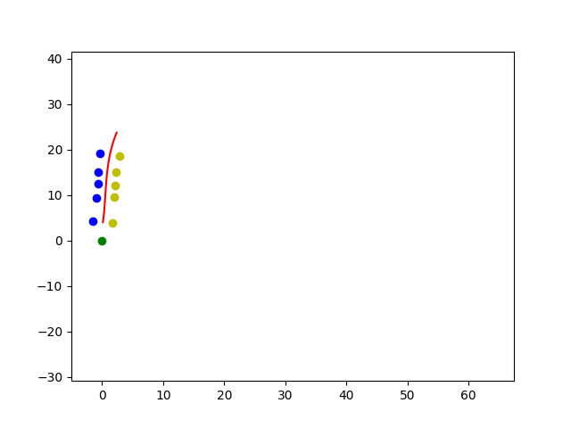
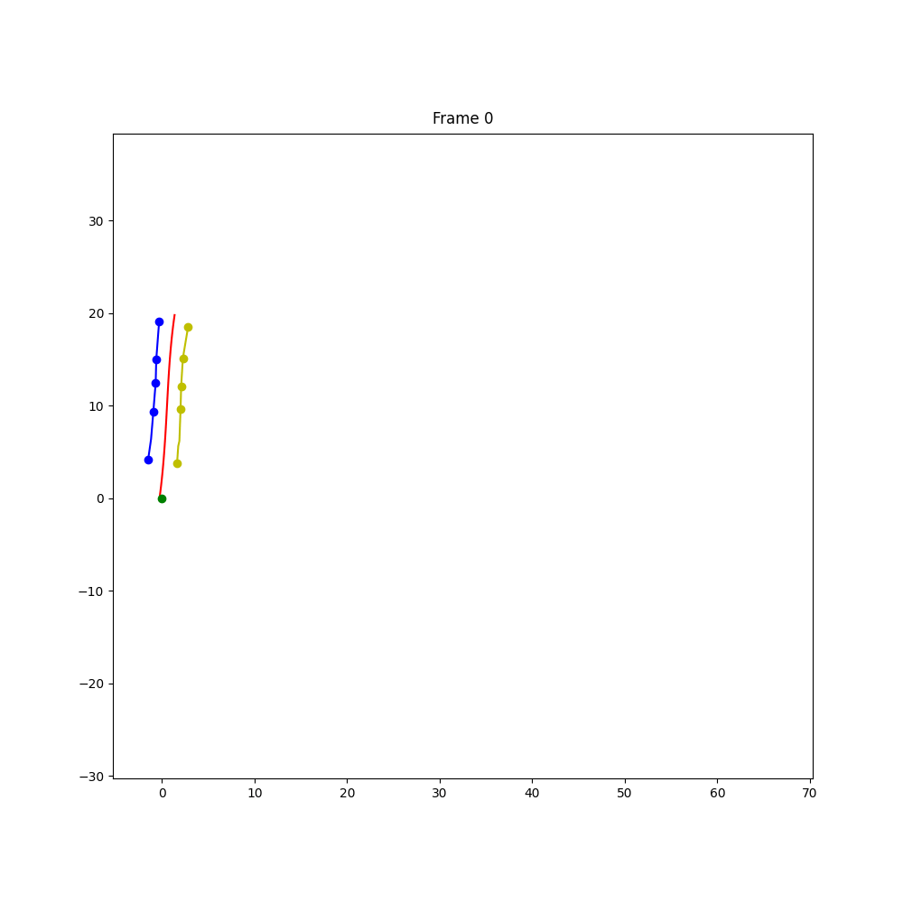
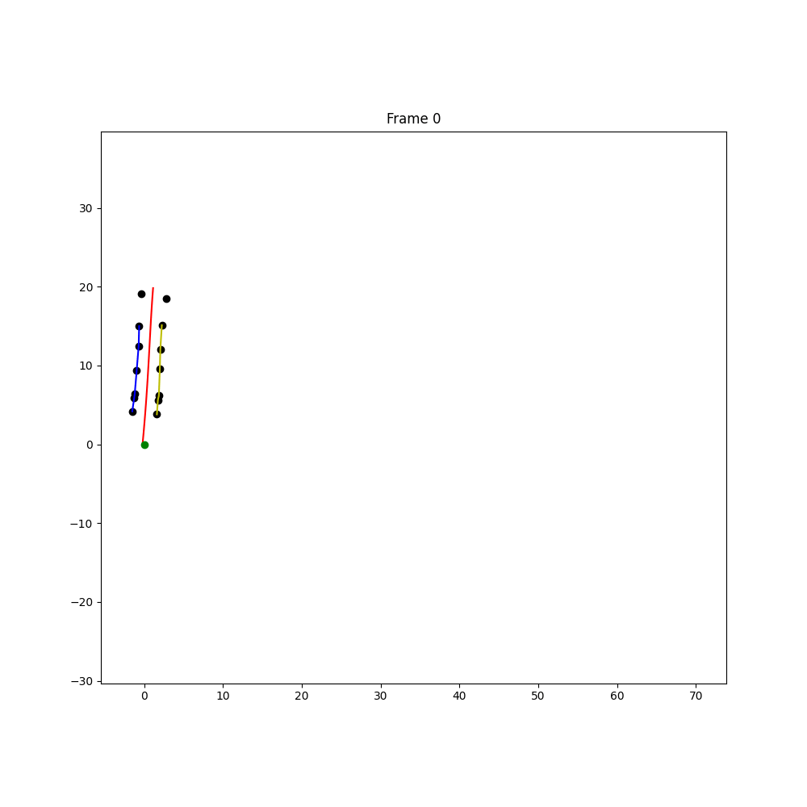

# ft-fsd-path-planning

FaSTTUBe Formula Student Driverless Path Planning Algorithm

<!--  -->

| With color information | Without color information |
| ---------------------- | ------------------------- |
|                        |                           |

This repository contains the path planning algorithm developed by FaSTTUBe for the 2021/22 Formula Student season. In March 2023, a further development of this algorithm was published. The new version has two main improvements:

- The algorithm can now work without color. It can use cones for which the color is known and cones for which the color is unknown at the same time.
- Performance improvements. The algorithm is faster, with the main focus of improvement being the cone sorting step.

You can find an **interactive demo** of the algorithm <a href="https://papalotis-ft-fsd-path-planning-streamlit-main-63xmrt.streamlitapp.com/" target="_blank">here.</a>

List of contributors:

- Panagiotis Karagiannis
- Albert Thelemann

The intention of this repository is to provide teams entering the driverless category with a path planning algorithm, so that they can get up and running as fast as possible. Teams are encouraged to use this repository as a basis and adapt it to their own pipeline, as well as make changes that will improve the algorithm's performance.

The algorithm differs from other common path planning approaches in that it can very robustly handle one side of the track not being visible, for example the inside of a corner. This is a common problem in the driverless category, especially for new teams with less sophisticated detection pipelines.

Parts that are specific to the FaSTTUBe pipeline have been removed. The algorithm is now a standalone library that can be used in any pipeline. It is a Python package that can be installed using pip.

The algorithm requires the following inputs:

- The car's current position and orientation in the slam map
- The position of the (optionally colored) cones in the slam map

The algorithm outputs:

- Samples of a parameterized b-spline with the x,y and curvature of the samples

The algorithm is completely stateless. Every time it is called no previous results are
used. The only aspect that can be used again is the path that was previously generated.
It is only used if the path calculation has failed.

The parts of the pipeline are also available as individual classes, so if you only
want to use parts of it you can do so.

The codebase is written entirely in Python and makes heavy use of NumPy, SciPy, and Numba.

## Installation

The package can be installed using pip:

```bash
pip install "fsd-path-planning[demo] @ git+https://git@github.com/papalotis/ft-fsd-path-planning.git"
```

This will also install the dependencies needed to run the demo (cli, matplotlib, streamlit, etc.). If you don't want to install the demo dependencies, you can install the package without the `demo` extra:

```bash
pip install "fsd-path-planning @ git+https://git@github.com/papalotis/ft-fsd-path-planning.git"
```

You can also clone the repository and install the package locally:

```bash
git clone https://github.com/papalotis/ft-fsd-path-planning.git
cd ft-fsd-path-planning
pip install -e .[demo]
```

You can again skip the `[demo]` extra if you don't want to install the demo dependencies.

## Performance

The algorithm is fast enough to run in real-time on a Jetson Xavier AGX 16GB on MAXN power mode. On that platform, the algorithm takes on average around 10ms for the entire algorithm to run from start to finish. You can run the demo to get an idea of the performance on your hardware.

*Note that the first time that you run the algorithm, it will take around 30-60 seconds to compile all the Numba functions. Run the demo a second time to get a real indicator on performance.*

Run the following command to run the demo on your machine:

```bash
python -m fsd_path_planning.demo
```

## Basic usage

```python
from fsd_path_planning import PathPlanner, MissionTypes, ConeTypes

path_planner = PathPlanner(MissionTypes.trackdrive)
# you have to load/get the data, this is just an example
global_cones, car_position, car_direction = load_data() 
# global_cones is a sequence that contains 5 numpy arrays with shape (N, 2),
# where N is the number of cones of that type

# ConeTypes is an enum that contains the following values:
# ConeTypes.UNKNOWN which maps to index 0
# ConeTypes.RIGHT/ConeTypes.YELLOW which maps to index 1
# ConeTypes.LEFT/ConeTypes.BLUE which maps to index 2
# ConeTypes.START_FINISH_AREA/ConeTypes.ORANGE_SMALL which maps to index 3
# ConeTypes.START_FINISH_LINE/ConeTypes.ORANGE_BIG which maps to index 4

# car_position is a 2D numpy array with shape (2,)
# car_direction is a 2D numpy array with shape (2,) representing the car's direction vector
# car_direction can also be a float representing the car's direction in radians

path = path_planner.calculate_path_in_global_frame(global_cones, car_position, car_direction)

# path is a Mx4 numpy array, where M is the number of points in the path
# the columns represent the spline parameter (distance along path), x, y and path curvature

```

Take a look at this notebook for a more detailed example: [simple_application.ipynb](https://github.com/papalotis/ft-fsd-path-planning/blob/main/fsd_path_planning/demo/simple_application.ipynb)
