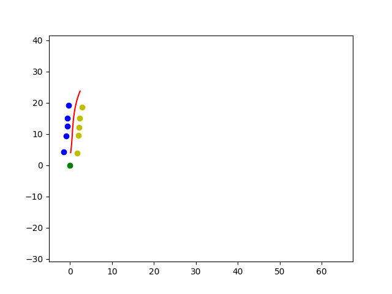

# ft-fsd-path-planning

FaSTTUBe Formula Student Driverless Path Planning Algorithm

<!--  -->

| With color information | Without color information |
| ---------------------- | ------------------------- |
| Autocross FSG 2019
|      |                     |
| Skidpad |
|   |   |

> [!NOTE]
> You can find an interactive demo of the algorithm <a href="https://ft-fsd-path-planning.streamlit.app//" target="_blank">here.</a>

## Updates 

### April 2026 (v0.5.0) :star: 100 stars!

This release focuses on code quality, modularity, and developer experience. No algorithmic changes were made, all existing behavior is preserved. The changes have been made with the goal of making the codebase easier to understand, maintain, and extend, as well as improving the experience for contributors.

#### API improvements

- Pipeline modules (`ConeSorting`, `ConeMatching`, `CalculatePath`) now accept input via `run_*()` methods with dedicated input dataclasses, replacing the old `set_new_input()` + `calculate()` pattern. The old pattern still works but emits a `DeprecationWarning`.
- Pipeline modules return typed result dataclasses (`SortingResult`, `MatchingResult`, `PathResult`) that also support tuple unpacking for backward compatibility.
- Consistent field naming across all modules: `vehicle_position`, `vehicle_direction`, `cones_by_type`.
- `PathPlanner` now supports dependency injection — pass custom `cone_sorting`, `cone_matching`, or `pathing` instances to the constructor.

#### Modularity

- `CalculatePath` internals extracted into `path_basis_selector` (side selection, centerline) and `path_extender` (path connection, extension, trimming).
- Long function `neighbor_bool_mask_can_be_added_to_attempt()` broken into focused helpers: `_check_angle_continuity()`, `_check_forward_direction()`, `_check_no_car_collision()`.
- Module-level global caches replaced with instance-scoped `AdjacencyMatrixCache` and `NearbyConeSearcher`, owned by `TraceSorter`.
- Relocalization and standard sorting+matching flows extracted into separate methods in `PathPlanner`.

#### Configuration

- All magic numbers extracted into dataclass-based configs: `SortingConfig`, `MatchingConfig`, `PathConfig`.
- Configs are optional constructor parameters with sensible defaults.
- `PathConfig` uses the clearer names `path_length` and `number_of_samples`; the old `mpc_path_length` and `mpc_prediction_horizon` names still work as compatibility aliases.

#### Tooling

- Migrated to [uv](https://docs.astral.sh/uv/) for dependency management and builds (hatchling backend).
- Replaced black + pylint + mypy with [ruff](https://docs.astral.sh/ruff/) (linting & formatting) and [pyright](https://github.com/microsoft/pyright) (type checking).
- Added [nox](https://nox.thea.codes/) for automated multi-version testing (Python 3.10–3.13).
- Added GitHub Actions CI running lint, type check, and tests on every push/PR.
- Added `py.typed` marker (PEP 561) for downstream type checking.
- Added explicit `__all__` to the public API.

#### Migration guide for deprecated patterns

Two patterns from earlier releases still work but emit a `DeprecationWarning`.
Update them at your convenience — they will be removed in a future release.

**1. Keyword-argument constructors**

Old (deprecated):

```python
sorter  = ConeSorting(max_n_neighbors=5, max_dist=6.5)
matcher = ConeMatching(min_track_width=3.0)
pather  = CalculatePath(smoothing=0.2, mpc_path_length=20.0)
```

New (use a config dataclass):

```python
from fsd_path_planning.config_dataclasses import SortingConfig, MatchingConfig, PathConfig

sorter  = ConeSorting(config=SortingConfig(max_n_neighbors=5, max_dist=6.5))
matcher = ConeMatching(config=MatchingConfig(min_track_width=3.0))
pather  = CalculatePath(config=PathConfig(smoothing=0.2, path_length=20.0))
```

**2. `set_new_input()` + `calculate()` pattern**

Old (deprecated):

```python
sorter.set_new_input(sorting_input)
result = sorter.run_cone_sorting()
```

New (pass input directly):

```python
result = sorter.run_cone_sorting(sorting_input)
```

### December 2023, July 2024 (v0.4)

#### (v0.4.3)

- Added `Acceleration` relocalization and stable acceleration path calculation.
- Added caching mechanism for the sorting step (about 20% performance improvement). 

> [!IMPORTANT]
> The caching step slightly changes the logic of the algorithm and has not been thoroughly tested. By default, the caching is disabled. To enable it, set the `experimental_performance_improvements` parameter of the `PathPlanner` class to `True`.

#### (v0.4.1)

Added a property to the PathPlanner class that gives information about the relocalization process. The property is called `relocalization_info` and is a dataclass called `RelocalizationInformation`. It contains the following fields:

- `translation` - A 2d array with the translation of the relocalization
- `rotation` - A float with the rotation of the relocalization

If the relocalization process has not been run, or is not relevant (currently only Skidpad has relocalization), the property will return `None`.

The internal Skidpad frame has its origin at the center of the Skidpad, with the x-axis pointing towards the exit of the Skidpad and the y-axis pointing to the left-hand loop.

#### (v0.4.0)

Further improvements were added in December 2023. The main focus was to make the Skidpad mission more robust. The algorithm now uses a different approach for the Skidpad mission, which is much simpler and does not rely on the color of the cones at all.

The logic that runs during the Skidpad mission is stateful, so if you want to use it, you will have to review the usage of the relevant classes including `PathPlanner`. More specifically, while in the past one could create a new instance of the `PathPlanner` class, for each computation, with minimal performance penalties, now this will cause the Skidpad path calculation to fail. It is recommended to create a new instance of the `PathPlanner` class when the vehicle enters `AS-READY` state and the SLAM pose has stabilized.

This version also adds `scikit-learn` as a dependency, which is used for the Skidpad mission. You may use the `summer-23` tag if you want to use the version of the algorithm that does not require `scikit-learn` and does not have the Skidpad improvements.

### March 2023 (v0.3)

 In March 2023, a further development of this algorithm was published. The new version has two main improvements:

- The algorithm can now work without color. It can use cones for which the color is known and cones for which the color is unknown at the same time.
- Performance improvements. The algorithm is faster, with the main focus of improvement being the cone sorting step.

## Introduction

This repository contains the path planning algorithm developed by FaSTTUBe for the 2021/22 and 2022/23 Formula Student seasons.

The intention of this repository is to provide teams entering the driverless category with a path planning algorithm, so that they can get up and running as fast as possible. Teams are encouraged to use this repository as a basis and adapt it to their own pipeline, as well as make changes that will improve the algorithm's performance. If your team decides to use this repository, feel free to inform us. We would be happy to hear about your experience.

The algorithm differs from other common path planning approaches in that it can very robustly handle one side of the track not being visible, for example the inside of a corner. This is a common problem in the driverless category, especially for teams with less sophisticated detection pipelines.

Parts that are specific to the FaSTTUBe pipeline have been removed. The algorithm is now a standalone library that can be used in any pipeline. It is a Python package that can be installed using [uv](https://docs.astral.sh/uv/).

The algorithm requires the following inputs:

- The car's current position and orientation in the slam map
- The position of the (optionally colored) cones in the slam map

The algorithm outputs:

- Samples of a parameterized b-spline with the x,y and curvature of the samples

The algorithm is completely stateless. Every time it is called no previous results are
used. The only aspect that can be used again is the path that was previously generated.
It is only used if the path calculation has failed.

The parts of the pipeline are also available as individual classes, so if you only
want to use parts of it you can do so.

The codebase is written entirely in Python and makes heavy use of NumPy, SciPy, and Numba.

The algorithm has demonstrated its success as part of the FaSTTUBe pipeline, contributing to a 2nd place finish in Trackdrive at FS Czech 2023.

## Installation

The package can be installed using [uv](https://docs.astral.sh/uv/):

```bash
uv add "fsd-path-planning[demo] @ git+https://github.com/papalotis/ft-fsd-path-planning.git"
```

This will also install the dependencies needed to run the demo (cli, matplotlib, streamlit, etc.). If you don't want to install the demo dependencies, you can install the package without the `demo` extra:

```bash
uv add "fsd-path-planning @ git+https://github.com/papalotis/ft-fsd-path-planning.git"
```

You can also clone the repository and install the package locally:

```bash
git clone https://github.com/papalotis/ft-fsd-path-planning.git
cd ft-fsd-path-planning
uv sync --extra demo
```

You can again skip the `--extra demo` if you don't want to install the demo dependencies.

<details>
<summary>Installation with pip</summary>

You can also use pip directly:

```bash
pip install "fsd-path-planning[demo] @ git+https://github.com/papalotis/ft-fsd-path-planning.git"
```

Or for a local install:

```bash
pip install -e .[demo]
```

</details>

## Performance

The algorithm (with default parameters) is fast enough to run in real-time on a Jetson Xavier AGX 16GB on MAXN power mode. On that platform, the algorithm takes on average around 10ms from start to finish. You can run the demo to get an idea of the performance on your hardware.

*Note that the first time that you run the algorithm, it will take around 30-60 seconds to compile all the Numba functions. Run the demo a second time to get a real indicator on performance.*

Run the following command to run the demo on your machine:

```bash
uv run python -m fsd_path_planning.demo
```

## Basic usage

```python
from fsd_path_planning import PathPlanner, MissionTypes, ConeTypes

path_planner = PathPlanner(MissionTypes.trackdrive)
# you have to load/get the data, this is just an example
global_cones, car_position, car_direction = load_data() 
# global_cones must contain exactly 5 numeric numpy arrays with shape (N, 2),
# where N is the number of cones of that type

# ConeTypes is an enum that contains the following values:
# ConeTypes.UNKNOWN which maps to index 0
# ConeTypes.RIGHT/ConeTypes.YELLOW which maps to index 1
# ConeTypes.LEFT/ConeTypes.BLUE which maps to index 2
# ConeTypes.START_FINISH_AREA/ConeTypes.ORANGE_SMALL which maps to index 3
# ConeTypes.START_FINISH_LINE/ConeTypes.ORANGE_BIG which maps to index 4

# car_position must be a finite 2D numpy array with shape (2,)
# car_direction must be either:
# - a finite 2D numpy array with shape (2,) representing the car's direction vector
# - a finite float representing the car's direction in radians
# A zero direction vector is rejected.

path = path_planner.calculate_path_in_global_frame(global_cones, car_position, car_direction)

# path is a Mx4 numpy array, where M is the number of points in the path
# the columns represent the spline parameter (distance along path), x, y and path curvature

```

`calculate_path_in_global_frame()` validates its public inputs before running the
pipeline. Invalid inputs raise `TypeError` or `ValueError` with a stable error
message instead of failing later in the geometry code.

The most important input rules are:

- `global_cones` must contain exactly 5 arrays ordered by `ConeTypes`.
- Every cone array must be numeric, finite, and shaped `(N, 2)`.
- `car_position` must be numeric, finite, and shaped `(2,)`.
- `car_direction` must be either a finite scalar angle or a finite non-zero vector
  shaped `(2,)`.

Take a look at this notebook for a more detailed example: [simple_application.ipynb](fsd_path_planning/demo/simple_application.ipynb)

> [!TIP]
> There is no resetting functionality in the classes. If you want to reset the path planner, you can simply create a new instance of the class.
It is recommended to create a new instance of the relevant classes when the vehicle enters `AS-READY` state.

## Development

### Setup

```bash
git clone https://github.com/papalotis/ft-fsd-path-planning.git
cd ft-fsd-path-planning
uv sync --extra dev --extra test
```

### Running tests

```bash
uv run pytest
```

### Multi-version testing

The project uses [nox](https://nox.thea.codes/) to test against multiple Python versions:

```bash
uv run nox -s tests          # test on Python 3.10, 3.11, 3.12, 3.13
uv run nox -s tests-3.12     # test on a specific version
uv run nox -s lint            # run ruff linter and formatter check
uv run nox -s typecheck       # run pyright type checking
```

### Type checking

The package ships a `py.typed` marker (PEP 561), so type checkers like pyright will pick up the inline type annotations automatically when using the package as a dependency.

## Previous versions

Alternate versions of the algorithm are available as git tags:

- `color-dependent` - The algorithm needs color information to work. This version was used in the 2021/22 season.
- `summer-23` - The algorithm can work without color information. This version was used in the 2022/23 season.
